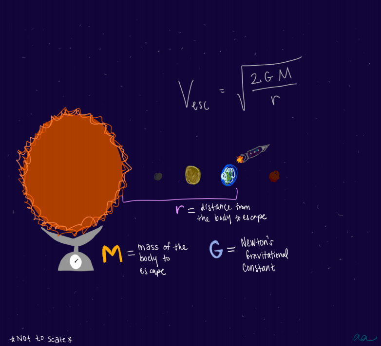

```{r setup, message=FALSE}
# load tidyverse including packages tibble, dplyr and ggplot
library(tidyverse)
knitr::opts_chunk$set(comment = "#>")
```

# Learning Goals
1. Practice using tibbles & basic plotting with R
2. Familiarize with the concept of escape velocity and compute it for each planet in the Solar System
3. Visualize the effect of mass and distance from a gravitational source and the velocity needed to escape
4. Determine the escape velocity needed to leave the Solar System

# Background

**Escape velocity** is the minimum velocity which an object must have in order to escape the *gravitational influence* of a particular planet or other object. 

**Gravity** is the force pulling together all matter. The more matter, the more gravity, so things that have a lot of matter such as planets and moons and stars pull more strongly. The strength of gravity also depends how close you are to the massive source (and the further away you are, the weaker the gravitational influence). 

**Mass** is the measure of the amount of matter in something. The more massive something is, the more of a gravitational pull it exerts. Here on Earth, as we walk on the surface, the Earth pulls on us AND we pull back on the Earth! But since the Earth is so much more massive, the pull from us is not strong enough to move the Earth.

Mathematically, escape velocity is derived from the concept that if the *kinetic energy* of an object launched was equal in magnitude to the *gravitational potential energy*, then in the absence of friction resistance it could escape from the Earth.

**Kinetic energy** is the measure of a mass in motion. The more massive something is, and the faster it is moving -- the more kinetic energy it will have. Kinetic energy is measured in units of 
$$ KE = \frac{1}{2}mv^2$$

**Gravitational potential energy** is the measure of the gravitational influence on a mass near another more massive object. To visualize this, let's consider how the Earth experiences gravitational potential energy from the Sun. The amount of gravitational potential energy the Earth has depends on the mass of the Earth, the mass of the Sun, and the distance from the Earth to the Sun. If the Earth were smaller and farther away (like Mars for example), then it would have less gravitational potential energy. *Note: M is the mass of the larger body (to escape from), and m is the mass of the smaller body (the one doing the escaping) and since m <<< M, m+M is essentially equal to M*

$$ GPE = \frac{GMm}{r} $$

Kinetic and gravitational potential energy are measured in units of $joules$ (or $ \left[\frac{kg⋅m^2}{s^{−2}}\right]$ in SI units).

By setting the two equal, we can solve for the velocity. Velocity is measured in units of $m/s$. 

$$ V_{esc} = \sqrt{\frac{2GM}{r}}$$

where $M$ is the mass of the body to escape, $G$ is Newton's gravitational constant and $r$ is the distance from the center of mass of the body creating a gravitational influence. 

<center><center/>

# Example
Since escape velocity depends on the mass of and distance from the object of gravitational influence we are trying to escape, let's consider how much easier it is to escape the Earth versus the Sun. 

For reference, the mass of the sun ($M_{sun}$) is $1.989 × 10^{30} kg$, the mass of the Earth ($M_{earth}$) is $5.972 × 10^{24} kg$ and Newton's gravitational constant ($G$) is $6.674×10^{-11} \frac{m^3}{kg^1s^2}$. The distance to the Sun's center from Earth ($r_{sun}$) is $1.496x10^{11} m$ and the distance to Earth's center from Earth's surface ($r_{earth}$) is $6.371 x 10^6 m$.

**Sequences**
Sequences are useful when defining a range of values. In general, the form is seq(start, stop, by=x).

```{r}
# let's illustrate the influence of distance from gravitational influence and escape velocity by making a sequence of distances (in meters)

distances <- seq(1e4, 1e6, by=1e5)

# Let's set a mass constant so that only distance is changing
mass <- 6e24 # [kg]

# Compute the escape velocity for each distance point in the array
G <- 6.67E-11 # Newton's gravitational constant [m3/kgs2]
escape_v = sqrt((2*G*mass)/distances) /1000  # converted to km/s
```

**Tibble**
Tibbles are tidyverse dataframes that hold data in columns and rows (like a table, or an array in python). We will use these to store data and to produce plots. Let's make a tibble to illustrate the influence of distance from gravitational influence and escape velocity.

```{r}
ss_data <- tibble(
  body = c("sun", "mercury", "venus", "earth", "moon", "mars", "jupiter", "saturn", "uranus", "neptune", "pluto"), # character strings as major bodies in the solar system
  r = c(1.5e11, 2440000, 6050000, 6380000, 1740000,
        3400000, 71500000, 60300000, 25600000, 24800000, 1190000), # distance from body center, aka radius, in meters
  m = c(1.99e30, 3.3e23, 4.87e24, 5.97e24, 7.3e22, 6.42e23,
        1.9e27, 5.68e26, 8.68e25, 1.02e26, 1.46e22) # masses of the bodies, in kg
)
```

Tibbles can also include sequences within them. 
``` {r}
practice_data <- tibble(
  distance = seq(1e4, 1e6, by=1e5),
  escape_velocity = escape_v
)
practice_data
```

**Plotting**
We will use the grammar of graphics plotting (ggplot) tool. 

```{r}
ggplot(practice_data, aes(distance, escape_velocity))+ # establish plot and define which dataset (tibble) to be used
  geom_point()+ # plot data as scatter of points
  geom_line(color='purple')+ # fit a line to the data
  labs(x="Distance [m]", y="Escape velocity [km/s]",
  title="relationship between escape velocity and distance (an inverse square-root)") # add labels and a title
```
# Test your understanding (questions to practice)
1. Print the contents of the solar system data tibble "ss_data". Then, print only the information relevant to the Earth and the Sun.
2. Compute the escape velocity for each body is ss_data and print
3. Plot the escape velocity for each body in ss_data as a function of mass and then as a function of radius
4. What do you think is the escape velocity for the solar system? Hint: you have already computed it. 

# Solutions
**1. Print the contents of the solar system data tibble "ss_data". Then, print only the information relevant to the Earth and the Sun.**

The first part of this questions is pretty straightfoward. The second part might require some investigating into R and tibble documentation to use subsetting to get only Sun and Earth rows:

```{r}
print(ss_data) # printing the contents of ss_data
print(ss_data %>% filter(body=="sun")) # this data will be just for the sun
print(ss_data %>% filter(body=="earth")) # this data will be just for the earth
```

**2. Compute the escape velocity for each body is ss_data and print**

```{r}
G <- 6.67E-11 # Newton's gravitational constant [m3/kgs2]
newss_data <- 
  ss_data %>% mutate(
    esc_v = sqrt((2*G*m)/r)/1000) # convert to km/s

print(newss_data) # prints tibble now including esc_v     

```

**3. Plot the escape velocity for each body in ss_data as a function of mass and then as a function of radius**

```{r}
ggplot(newss_data, aes(r, esc_v))+ # establish plot and define which dataset (tibble) to be used
  geom_point()+ # plot data as scatter of points
  scale_x_continuous(trans='log10')+ #set the x axis to be a log scale
  labs(x="Distance [m]", y="Escape velocity [km/s]",
  title="relationship between escape velocity and radius for bodies in the solar system")+ # add labels and a title
  geom_text(aes(label=body),hjust=1, vjust=0) # add labels to the points
```

**4. What do you think is the escape velocity for the solar system? Hint: you have already computed it.**

Given that the Sun is the central mass of the solar system, the escape velocity of the solar system is the escape velocity of the Sun.

