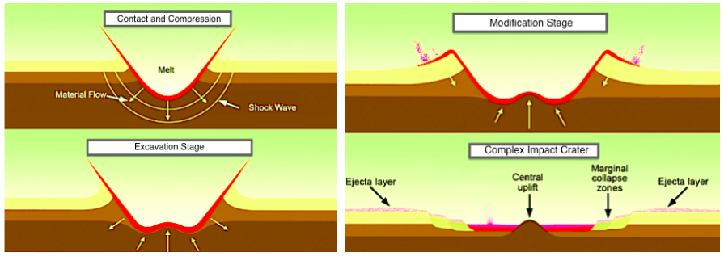

```{r setup, message=FALSE}
# load tidyverse including packages tibble, dplyr and ggplot
library(tidyverse)
knitr::opts_chunk$set(comment = "#>")
```

# Learning Goals
1. Describe the formation process for an impact event
2. Identify which variable has the strongest effect on crater size
3. Calculate the estimated diameter for a given impactor on Earth
4. Scale an impact event on Earth for the same impact event on the Moon

# Background
An **impact event** occurs when an object, generally referred to as a projectile or bolide, crosses orbits and collides with another body. The object whose orbit is intersected and impacted is called the **target**. The resulting structure, almost always a rounded, concave feature, is known as an **impact crater**. Cratering is the primary geomorphologic process in the solar system. As such, understanding this process on Earth is fundamental to understanding the surfaces and geologic evolutions of other worlds. 

The physical process shaping impact craters are (almost) universal across scales and planetary body conditions— hence their quintessential appearance on all solid bodies we have observed. To describe the complicated physical processes which govern crater formation, Melosh 1989 outlines a chronological sequence of the stages in cratering formation from the impactor’s first touch with the target to the final stage of the crater as it is being smoothed by viscous degradation. These stages are referred to as: **Contact and Compression, Excavation and Modification.**

## Contact and Compression 
This first stage begins when the impactor initially makes contact with the target and nearly all of the impactor impulse is delivered to the target. The shock wave propagates through the impactor on a timescale of $\frac{l}{v}$ where $l$ is the radius of the projectile and $v$ is the impact velocity. This is the *shortest stage* in the crater formation, taking about twice the shock crossing time of the impactor. For example, the Contact and Compression stage for a 1-meter impactor with velocity of 10 km/s takes about $10^{-3}$ seconds; compared to a 1 km impactor with the same impact velocity that takes about 0.1 seconds. 

## Excavation 
Strong shock waves start to propagate through the target and most of the volume of the initial crater is excavated. During this phase, two different-yet-connected physical mechanisms are at work: the propagation of the dissipating shock waves and the excavation flow (initiated by the shock waves).

Crater growth starts as the hemispherical cavity expands after the first contact until it reaches about one third of the final depth of the transient crater. Growth continues only in the radial direction, as the strength of the target material prevents further deepening. As the crater’s growth comes to a stop, we have the geological formation of “transient crater”. This phase of crater formation takes about *100 times longer than the Contact and Compression phase* and is *determined by the gravity of the target*. 

## Modification 
After the crater growth is over, the displaced material falls back to fill the crater. This final stage of crater formation can *vary by crater size and gravity*. For instance, small/simple craters (< 10s of km) simply fill and are left with crater walls near the angle of repose. Simple craters are often described as bowl-shaped, exhibit little-to-no topography in the crater floor, and have depth-to-diameter ratios between 1:3 and 1:5 on Earth (Melosh, 1989).

Different processes are at play for large, ‘complex’ craters (> 100s of km), which can have central peaks and/or rings in the crater floor. The transition of simple-to-complex crater is highly dependent on the gravity of the planet. The timescale for these processes are proportional to $\frac{L}{g}$ where $l$ is the crater diameter and $g$ is the gravitational acceleration of the planet.

The last step that modifies the crater is viscous degradation, which is due to the rheological viscosity of the material— no rock is really solid, but a very thick fluid. Hence, on geological timescales the material of the target would like to recover the minimum energy state, which is the flat plane. This mechanism for eradicating craters becomes more efficient with increasing temperature of the target and might be important on Venus.

<center><center/>

## Impact Velocity
The impact velocity (speed and direction of impact) is determined by the location in the solar system where the impact occurs -- impacts futher from the Sun will have lower impact velocities while collisions closer to the Sun will have higher impact velocities. This is due to the acceleration caused by the Sun's strong gravitational pull. Futhermore, impacts into larger bodies (e.g., Earth and Venus) will have higher impact velocities relative to smaller, nearby bodies (e.g., Moon and Mars) as there is a gravitational acceleration from the planet or moon as well.

The minimum impact velocity is equal to the escape velocity of the target, $v_{esc} = \sqrt{\frac{2GM_{t}}{r_t}}$ where $G$ is the gravitational constant, $M_t$ is mass of the target and $r_t$ is the radius of the target.

The maximum impact velocity is the sum of the escape velocity for the solar system and the orbital speed of the target body around the sun. The escape velocity from the solar system is appx. 42 km/s and the orbital speed of the Earth is ~30 km/s, for reference.

## Scaling
The most common approach for impact crater scaling has used the **"Pi-group scaling theorem"** -- which is essentially a fancy version of dimensional analysis in which the physically relevant parameters for the apparent diameter of a crater are impact velocity, $v$, target and projectile densities, $\rho_{targ}$ and $\rho_{proj}$, size of the impactor, $D_{proj}$, target strength, $Y$, gravity, $g$, and impact angle, $\theta$ 

Another parameter, is the simple-to-complex transition factor, which is target-body dependent.  $D_{sc}$ is the final rim diameter at the simple-to-complex transition. On Earth, craters larger than $D_{sc}$ ≈ 2−4 km have more complex morphologies, including central uplifts and peak rings.

Using the variables described above, Johnson et al., (2016) derived the following equation **(Equation 1)** for general use that relates impactor and target properties directly to the final crater rim diameter ($D_{fin})$:

**Equation 1:**
$$D_{fin} = 1.52(\frac{\rho_{proj}}{\rho_{targ}})^{0.38}D_{proj}^{0.88}v_{impact}^{0.5}g^{-0.25}D_{sc}^{-0.13}sin^{0.38}(\theta)$$

# Example
Mars is located (on average) 1.5 au from the Sun (about $228 x 10^{6}$ km), composed primarly of basalt and has a gravitational acceleration of ~$g = 3.2 m/s^2$. The mean orbital velocity is about 24 km/s. Suppose an 1 km object made also of basalt, traveling 10 km/s opposite Mars' orbital direction will collide head-on. What is the expected impact velocity?

