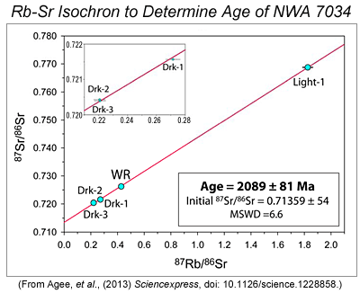
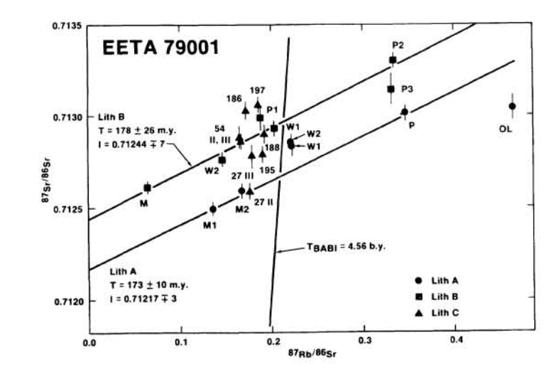

```{r setup, message=FALSE}
# load tidyverse including packages tibble, dplyr and ggplot
library(tidyverse)
library(latex2exp)
knitr::opts_chunk$set(comment = "#>")
```

# Learning Goals
1. Define how to compute the age of a discovered meteorite from the **radioactive decay law**
2. **Compute the age** of a martian meteorite using the Rb/Sr decay system
3. Define a **function in R** and return values
4. **Plot** an isochron **using ggplot's geom_point and geom_smooth** functions

# Prerequisites
*Concept requirements*
Students should have been introduced to the general concepts of radioactive decay and be comfortable manipulating algebraic equations (re-arranging and solving for different terms), calculating the slope of a line, and using ratios. It is expected that students already know what a meteorite is.

*Programming requirements*
A general understanding of the following in python is necessary: importing libraries, plotting straight lines, computing slope, use of dictionaries, lists, numpy arrays and loops. We will introduce functions and mapping. 

# Background
## Meteorites
**Meteorites** are among the oldest objects in the solar system, having formed early-on around 4.5 billion years ago. But how do we know how old a meteorite is?

When determining the age of very old objects, like meteorites, the only suitable mechanism that we have (so far) is the measurement of radioactive decay products. *Isotopes* are atoms of the same element that have different amounts of neutrons. Some isotopes are stable, while others are radioactive and decay into other components called *daughter* isotopes.

## Radioactivedecay 
**Radioactive decay** is the term used to describe the process by which an unstable atom loses energy to its surrounding environment. With radioactive decay, the nucleus of the atom changes from a parent nuclide to a daughter nuclide.  Radioactive isotopes decay according to a **power law** and the amount of time it takes the element to lose half of its radioactive atoms is termed an element's **half-life**. The amount of time it will take differs depending on the element.

**Radioactive decay law**:
$$ N(t) = N_{0}*e^{-\lambda t}$$
where $N(t)$ is the # of radioactive atoms at time $t$, $N_0$ is the initial # of radioactive atoms at time zero, $\lambda$ is the decay constant

**Half-life equation**:
$$t_{half} = \frac{\ln{2}}{\lambda}$$

## What isotopes are useful in dating meteorites?
We typically look to the decay of Rubidium ($^{87}Rb$) into Strontium ($^{87}Sr$), which has a half-life of 49 billion years. Here is a quick and dirty derivation. Don't spend too much effort in understanding this right now, but we want to briefly explore how we end up with the equation we will use to calculate ages in the example section. Age is  determined by calculating ratios of these isotopes:

$$^{87}Sr_{now} = ^{87}Sr_{original} + (^{87}Rb_{original} - ^{87}Rb_{now})$$

The term in partenthesis can be substituted using the radioactive decay law:
$$^{87}Rb_{original} = ^{87}Rb_{now}*e^{\lambda t}$$

Putting this back into the first equation, we get:
$$^{87}Sr_{now} = ^{87}Sr_{original} + ^{87}Rb_{now}*e^{\lambda t-1}$$

Finally, we must compare the decaying isotopes to a constant (stable) isotope. $^{86}Sr$ is the stable isotope used for comparison in meteorites (and rocks on Earth, too). Using the above equation, we simply divide by the expected amount of $^{86}Sr$,

**isochron equation:**
$$\frac{^{87}Sr_{now}}{^{86}Sr} = \frac{^{87}Sr_{original}}{^{86}Sr} + \frac{^{87}Rb_{now}}{^{86}Sr}*e^{\lambda t-1}$$

It might be hard to recognize, but this is simply the equation of a line in the form $ y = mx+b$ where $m$ (the slope) is $(e^{\lambda t-1})$ and $b$, the y-intercept, is the original strontium isotope ratio ($\frac{^{87}Sr_{original}}{^{86}Sr}$). 

In the lab, using a *mass spectrometer*, we could measure $\frac{^{87}Sr_{now}}{^{86}Sr}$ and $\frac{^{87}Rb_{now}}{^{86}Sr}$. By taking samples and measurements from meteorite bits, we can plot the results and the data should fall on a straight line whose slope characterizes the age of the meteorite. This line (slope, the age) is called the **isochron**. The image below is an example isochron from a real martian meteorite!

<center><center/>

# Example

<p>The Antarctic Search for Meteorites program (ANSMET) is a US-led field project that recovers meteorite specimens from Antarctica. Since 1976, more than 22,000 specimens have been discovered from the exposed surfaces along the Transantarctic Mountains. Finding these meteorites is important because they serve as a reliable, continuous source of new, non-microscopic extraterrestrial material and support thousands of scientists from around the globs as they seek essential “ground-truth” concerning the materials that make up the asteroids, planets and other bodies of our solar system.<p/>

Let's imagine we have acquired one of the ANSMET-discovered meteorites and we want to find out how old it is.

```{r}
# this is a function to compute the half-life constant, lambda
compute_decay_l <- function(t_half) {
  l <- log(2)/t_half
}

# this is a function to compute the age (isochron) for a given input of ratios Sr, Rb
compute_isochron <- function(Sr, Rb) {
  l <- compute_decay_l(4.9E10)
  slope <- (Sr[2]-Sr[1])/(Rb[2]-Rb[1])
  age <- (1/l)*log(slope+1)
}
```

Now that we have defined the functions, lets get the necessary info to find out how old our meteorite is. 

Here's the story:
Martian meteorite EETA 79001 was found on January 13, 1980 in Elephant Moraine, Antarctica. It is the second largest Mars meteorite ever found and was the first of the season to be discovered. The following data was manufactured for this exercise from the following figure (from Nyquist et al., 1986), but represents the actual estimated age of this meteorite (within ~50 million years).
<center><center/>

```{r}
# here is the manufacted data, in lists with the ratios of measured 87Sr and 87Rb relative to 86Sr
Sr87_Sr86 <- c(0.7124, 0.7125, 0.7126, 0.7129, 0.7130, 0.713, 0.7135, 0.714)  # in ppm
Rb87_Sr86 <- c(0, 0.1, 0.15, 0.2, 0.25, 0.3, 0.35, 0.40)                      # in ppm
initial_87Sr_86Sr <- 0.7124                                                  # in ppm, as reported in the paper
print("The est. age of meteorite EETA 79001 is (in Ma): ")
print(compute_isochron(Sr87_Sr86, Rb87_Sr86)/1E6)
```

# Questions (with answers)
**Q1.** We have discussed the isochron equation above as being in the form of a straight line. What are the independent and dependent variables of this equation?
*A1.* The equation of a straight line is $y = mx + b$ -- here $m$ (the slope) is $(e^{\lambda t-1})$ and $b$, the y-intercept, is the original strontium isotope ratio ($\frac{^{87}Sr_{original}}{^{86}Sr}$). In this case, the dependent (y) and independent (x) variables are actually the lab-measured values of $\frac{^{87}Sr_{now}}{^{86}Sr}$ (y) and $\frac{^{87}Rb_{now}}{^{86}Sr}$ (x). 

**Q2.** Suppose we are given another meteorite to analyze (yay!). Given the following information, **define a function to compute the slope (aka isochron) and age of this meteorite using the Rb/Sr decay system**. 

The meteorite is also from Antarctica and is probably the most famous martian meteorite: ALH 84001. Here is a table of Rb/Sr ratios for carbonates within the meteorite. All ratios are in ppm. There is an initial 87Sr/86Sr ratio of 0.70205 ± 0.00007 (data from Borg et al., 1999). For this exercise, you can ignore the error bars.

| Sample| $^{87}$Rb/$^{86}$Sr | $^{87}$Sr/$^{86}$Sr |
| ---- | ------- | ------- |
|S1	|  0.2600  ±  13 	| 0.728746  ±  18 |
|S2	|  0.2096  ±  11 	| 0.716338  ±  10 |
|S3	|  0.238  ±  12 	| 0.710308  ±  16 |
|S4	|  0.1172  ±  12	| 0.708653  ±  11 |
|S5	|  0.2327  ±  11 	| 0.715125  ±  10 |
|S6	|  2.622  ±  13 	| 0.850478  ±  42 |
|S7	|  2.391  ±  11  	| 0.840711  ±  42 |
|S8	|  1.421  ±  60 	| 0.787570  ±  18 |

*A2*. I will first pull some code from the example section and then apply it to our new sample:
```{r}
# this is a function to compute the half-life constant, lambda
compute_decay_l <- function(t_half) {
  l <- log(2)/t_half
}

# this is a function to compute the age (isochron) for a given input of ratios Sr, Rb
compute_isochron <- function(Sr, Rb) {
  l <- compute_decay_l(4.9E10)
  slope <- (Sr[2]-Sr[1])/(Rb[2]-Rb[1])
  age <- (1/l)*log(slope+1)
}

# here is an example of how to define a function to compute slope
compute_slope <- function(Sr, Rb){
  (Sr[-1]-Sr[-2])/(Rb[-1]-Rb[-2])
}
```

*A2, continued.* Next, I will define the data into two lists, Sr and Rb:

```{r}
Sr <- c(0.728746, 0.716338, 0.710308, 0.708653, 0.715125, 0.850478, 0.840711, 0.787570) # in ppm
Rb <- c(0.2600, 0.2096, 0.238, 0.1172, 0.2327, 2.622, 2.391, 1.421) # in ppm
```

*A2, continued.* Now, we can compute the slope, plot the data and determine the age:
```{r}
slope <- compute_slope(Sr, Rb)
isochron <- compute_isochron(Sr, Rb)
age <- isochron/10E6 # age in Ma
```

**Q3.** Plot the isochron computed in Q2 using ggplot. 
*A3.* Here we can use the ggplot library and associated aesthetics to visualize the isochron:
```{r}
ggplot()+
  geom_point(aes(Rb,Sr))+
  labs(title="Rb-Sr isotopic data for ALH 84001", x=TeX('$^{87}Rb_{now}/^{86}Sr$'), y=TeX('$^{87}Sr_{now}/^{86}Sr$'))
```

*A3, continued* Now, suppose we want to add a line to fit the data, we can use the geom_smooth function in ggplot. Let's also add some aesthetics like text to clearly show age and slope.
```{r}
slope <- (Sr[2]-Sr[1])/(Rb[2]-Rb[1])
age_text = paste("Age (Ma)=", sprintf("%.2f",age)) # concatenate age and text with .2 decimal precision
slope_text = paste("Slope = ", sprintf("%.2f", slope)) # concatenate slope and text with .2 decimal precision
ggplot()+
  geom_point(aes(Rb,Sr))+
  geom_smooth(method = "lm", se = FALSE, aes(Rb,Sr))+
  labs(title="Rb-Sr isotopic data for ALH 84001", x=TeX('$^{87}Rb_{now}/^{86}Sr$'), y=TeX('$^{87}Sr_{now}/^{86}Sr$'))+
  annotate("text", x=0.5, y=0.84, label=age_text)+ # specify x,y coord for location of text
  annotate("text", x=0.5, y=0.82, label=slope_text)
```

# The end! Well done.
